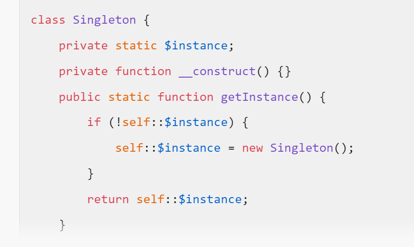
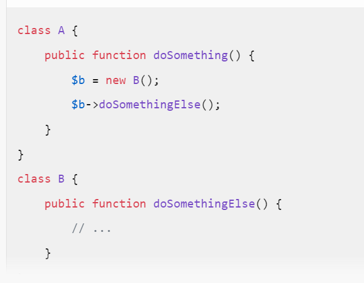
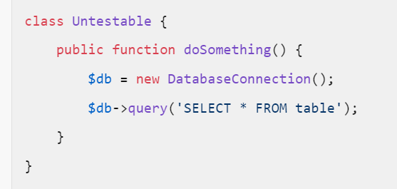
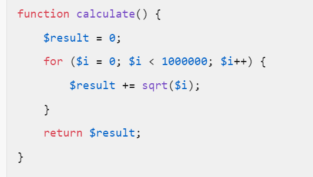
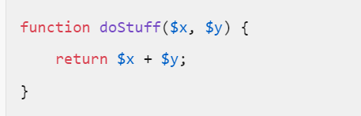

# D46 - Php / Design Pattern

## Principes SOLID

Les principes SOLID ont pour but de minimiser la variance des fonctions dans des objets et l'impact du contexte sur l'exécution des fonction d'un objet.

Voici la liste :
 - Single Responsability Principle
 - Open Closed Principle
 - Liskov Substitution Principle
 - Interface Seggregation Principle
 - Dependency Inversion Principle

Expliquez en quoi consiste chacun en une phrase.

## Anti patterns STUPID

L'accronyme STUPID liste des pratiques contestables dans le développement informatique du point de vue de la clarté du code et de la maintenabilité de l'application en général.

Les voici :
 - Singleton
 - Tight Coupling
 - Untestability
 - Premature Optimization
 - Indescriptive Naming
 - Duplication

Expliquez chacun en une phrase et donnez un exemple de code en Php.

## Design Pattern Adapter

Le pattern Adapter permet de faire travailler ensemble des objets qui ont des responsabilités similaires ou connexes, dont les prototypes ne sont pas compatibles.
Il permet de ne pas lier fortement des classes entre elles mais simplement à leurs comportements. Ainsi, quand un comportement doit évoluer, il n'y a pas de risques d'incompatibilité avec le reste de l'application.

Mise en place :
  - Identifier le comportement à adapter / à connecter
  - Abstraire ce comportement dans une interface
  - Créer une dépendance à cette interface dans la classe qui va faire appel au comportement, puis l'appeler
  - Créer une classe concrète qui implémente l'interface du comportement à adapter
  - Créer une dépendance sur la classe à adapter, puis l'utiliser

Voici les classes suivantes :
```php

class Product
{
    public function __construct(
        public ?int $id,
        public string $designation,
        public string $univers,
        public int $price
    ){
    }
}

class ProductRepository
{
    public function __construct(
        protected /* ??? */ $persistence
    ) {
    }

    public function save(Product $product)
    {
        $persistence->persist(
            // all arguments needed to proper persist a Product
        );
    }
}

class Database
{
    protected \PDO $connection;

    /**
     * @param string $dsn database connection DSN
     * @example new Database('mysql://root:@127.0.0.1:3306/app?serverVersion=10.11.2-MariaDB&charset=utf8mb4')
     */
    public function __construct(string $dsn)
    {
        $this->connection = new \PDO($dsn);
    }

    public function sqlQuery(string $sqlQuery)
    {
        $stmt = $this->connection->createStatement($sqlQuery);
        $stmt->execute();
    }
}

```

Créez le code permettrant de sauvegarder l'objet Product dans une base de données SQL via les classes ProductRepository et Database.

Modifiez ensuite votre code pour introduire un Adapter entre ProductRepository et Database.
Utilisez maintenant cet Adapter pour modifier la persistance des données sans modifier la classe Repository, pour écrire les données produits au format JSON dans un fichier au lieu d'une base de données.

Pour tous ces exercices, veillez à respecter les principes SOLID.

_Tips : ```json_encode()``` / ```file_put_contents()```_

_Exemple de fichier main.php :_
```php
$product = new Product(
    univers: 'Weapon',
    designation: 'FkingBigSword',
    price: 1200
);

$productRepository = new ProductRepository(
    new /* ...... */(
        Product::class,
        'id',
        new Database(/* .... */)
    )
);

$productRepository->save($product);
```

EVALUATION GUILLAUME L HULLIER

Brève explication pour chaque principe SOLID

Single Responsibility Principle (SRP) : Une classe doit avoir une seule responsabilité ou raison de changer.

Open/Closed Principle (OCP) : Les entités logicielles doivent être ouvertes à l’extension mais fermées à la modification.

Liskov Substitution Principle (LSP) : Les objets d’une classe dérivée doivent pouvoir remplacer les objets de la classe de base sans altérer le comportement du programme.

Interface Segregation Principle (ISP) : Les clients ne doivent pas être forcés à dépendre d’interfaces qu’ils n’utilisent pas.

Dependency Inversion Principle (DIP) : Les modules de haut niveau ne doivent pas dépendre des modules de bas niveau; les deux doivent dépendre d’abstractions.

L'accronyme STUPID liste des pratiques contestables dans le développement informatique 
	Singleton : Utiliser un seul objet global peut rendre le code difficile à tester et à maintenir 


	Tight Coupling : Les classes fortement couplées dépendent trop les unes des autres, ce qui rend les modifications difficiles. 

	Untestability : Le code qui ne peut pas être testé facilement est difficile à maintenir et à déboguer.

	


Premature Optimization : Optimiser le code trop tôt peut rendre le code complexe et difficile à comprendre 


	Indescriptive Naming : Utiliser des noms de variables ou de fonctions non descriptifs rend le code difficile à lire et à comprendre. 


EVALUATION GUILLAUME L HULLIER

Brève explication pour chaque principe SOLID

Single Responsibility Principle (SRP) : Une classe doit avoir une seule responsabilité ou raison de changer.

Open/Closed Principle (OCP) : Les entités logicielles doivent être ouvertes à l’extension mais fermées à la modification.

Liskov Substitution Principle (LSP) : Les objets d’une classe dérivée doivent pouvoir remplacer les objets de la classe de base sans altérer le comportement du programme.

Interface Segregation Principle (ISP) : Les clients ne doivent pas être forcés à dépendre d’interfaces qu’ils n’utilisent pas.

Dependency Inversion Principle (DIP) : Les modules de haut niveau ne doivent pas dépendre des modules de bas niveau; les deux doivent dépendre d’abstractions.

L'accronyme STUPID liste des pratiques contestables dans le développement informatique 
	Singleton : Utiliser un seul objet global peut rendre le code difficile à tester et à maintenir 




	Tight Coupling : Les classes fortement couplées dépendent trop les unes des autres, ce qui rend les modifications difficiles. 



	Untestability : Le code qui ne peut pas être testé facilement est difficile à maintenir et à déboguer.


	

Premature Optimization : Optimiser le code trop tôt peut rendre le code complexe et difficile à comprendre 




	Indescriptive Naming : Utiliser des noms de variables ou de fonctions non descriptifs rend le code difficile à lire et à comprendre. 


