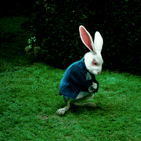

# ItAK-DFS31C

Dépôt support aux rendus d'exercice pour la session DFS31C de l'IT-Akademy.

Dans ce dépôt, vous trouverez les ressources utiles évoquées en cours ainsi que les consignes des différents exercices, et éventuellement leur correction.

Chaque devoir à rendre devra se faire sur ce dépôt en utilisant une pull-request depuis un fork sur votre espace personnel.
La pull request devra suivre le format "Nom Prenom - Titre exercice".

## Sommaire des exercices

- [D70 - Git / Github / Systèmes de versionning](D70_Git/README.md)

- Apprentissage des commandes usuelles ✅ [Sandbox - capture d'écran](exercices_sandbox_git.zip)
- Setup pro d'un compte Git - espace de travail - clés SSH - fork - PR - rebase_me ✅
- Ne pas laisser traîner ses artefacts ✅ [gitignore](.gitignore)
- Pre-commits ✅

- [D42 - Consolidation des connaissances en informatique](D42_Consolidation_info/README.md)

- Utilisation de Makefile ✅ [My custom Makefile](AutoUnix/makefile)
- Docker-compose ✅ [service configurations](docker/docker-compose.yml)
- nginx.conf [directives](docker/nginx.conf)

- [D70 - Git / Github / Systèmes de versionning](D70_Git/README.md)
- [D42 - Consolidation des connaissances en informatique](D42_Consolidation_info/README.md)
- [D46 - Php / Design Patterns](D46_Php_Design_Patterns/README.md)
- [D11 - Php / Symfony](D11_Php_Symfony/README.md)
- [AD9 - Consolidation des compétences système : Linux pour le web](AD9_Linux_web/README.md)

## Documentation

- [Livrer son travail](docs/workflow.md)

## Comme ça on aime les Gif ?? oui

- Fonctionnement d'internet pour les nuls [schéma pour Jean-Didier Sitiho](Jean-Didier-Sitiho/Fonctionnementd'internetpourlesnuls.jpg)
  

## Comme ça on aime les Gif ?? oui

=======

- [D70 - Git / Github / Systèmes de versionning](D70_Git/README.md)
- [D42 - Consolidation des connaissances en informatique](D42_Consolidation_info/README.md)
